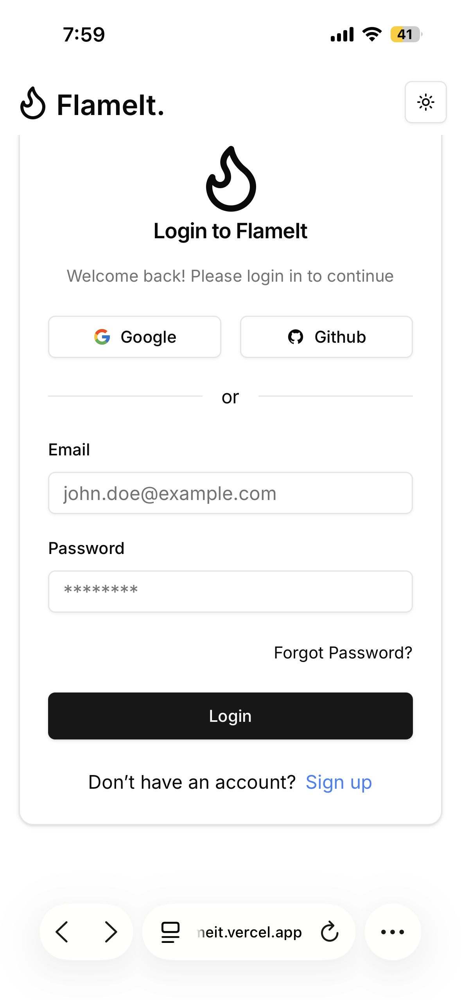
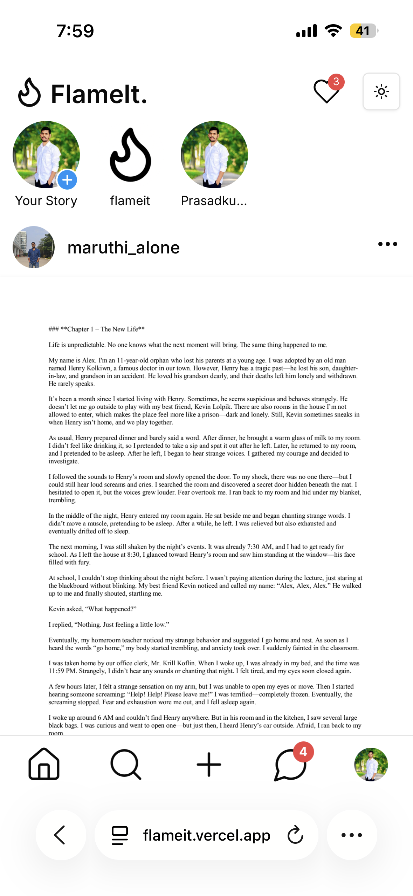
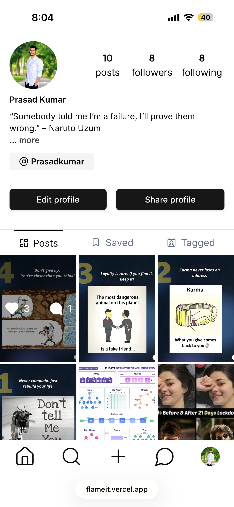
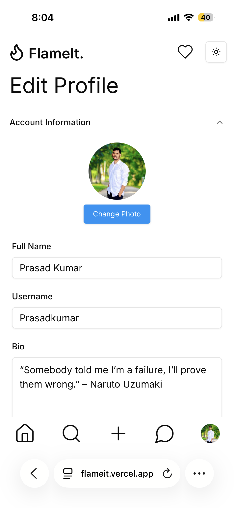
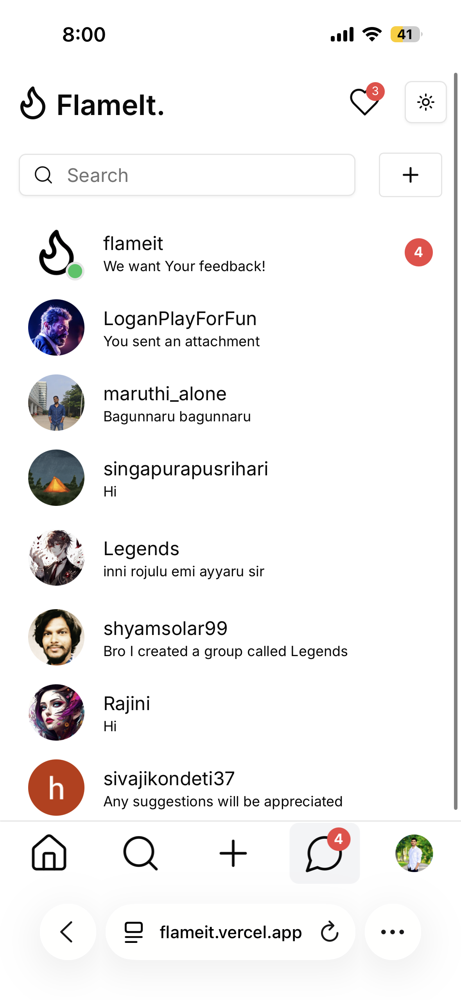
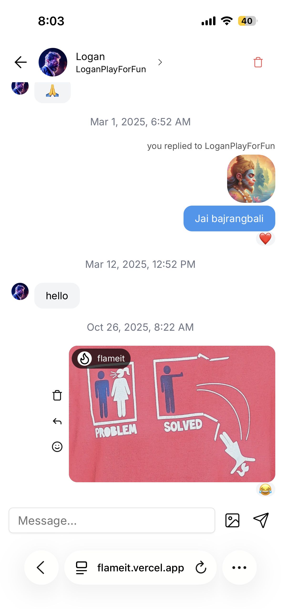
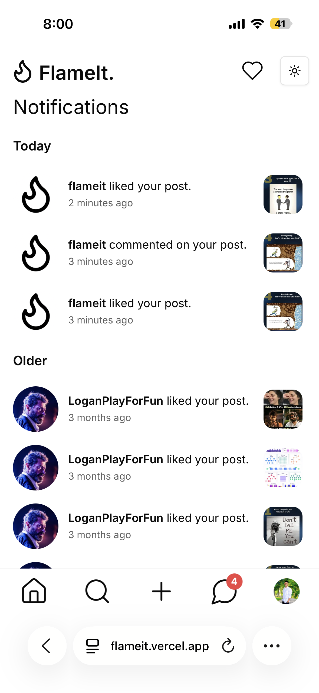

# 🔥 FlameIt – Real-Time Social Media Platform

FlameIt is a full-stack social media application inspired by modern platforms like Instagram. It includes real-time chat, stories, notifications, and user interaction features built using a scalable architecture.

---

## 🚀 Features

- 📸 Post creation with likes and comments  
- 💬 Real-time private and group chat  
- 📖 Stories feature (24-hour content)  
- 🔔 Notifications (likes, messages, follow requests)  
- 👤 User profiles with followers/following  
- 🔒 Private accounts with follow approval system  
- 🔍 Search functionality for users and content  

---

## 🛠 Tech Stack

**Frontend**
- Next.js
- React
- TypeScript
- Tailwind CSS  

**Backend**
- Next.js API Routes
- Node.js
- Express.js  

**Database**
- MongoDB (with Prisma ORM)  

**Real-Time**
- Socket.io  

---

## 📦 Getting Started

Follow these steps to set up the project locally.

---

### 1️⃣ Clone the Repository

```bash
git clone https://github.com/k-prasad-kumar/flameit.git
cd flameit
```

### 2️⃣ Install Dependencies

Make sure you have Node.js (v18 or above) installed.

```bash
npm install
```

### 3️⃣ Environment Variables Setup

Create a .env file in the root directory and add the following:

```env
NEXT_PUBLIC_SOCKET_URL="https://flameit-socket.onrender.com"
NEXT_PUBLIC_URL="http://localhost:3000"
OFFICIAL_ACCOUNT=67b5df949d7a9afa3510a003
OG_IMAGE=https://res.cloudinary.com/flameit/image/upload/v1739980937/FlameIt_bwfkto.gif
NODE_ENV="development"

NEXTAUTH_URL=http://localhost:3000
AUTH_SECRET=any_random_key_of_min_14_characters

DATABASE_URL=your_mongodb_connection_string

GITHUB_CLIENT_ID=your_client_id
GITHUB_CLIENT_SECRET=your_secret_key

GOOGLE_CLIENT_ID=your_client_id
GOOGLE_CLIENT_SECRET=your_secret_key

NEXT_PUBLIC_CLOUDINARY_CLOUD_NAME=your_cloudinary_cloud_name
NEXT_PUBLIC_CLOUDINARY_API_KEY=your_api_key
CLOUDINARY_API_SECRET=your_secret_key

SENDGRID_API_KEY=your_api_key
```

### 4️⃣ Run the Development Server

```bash
npm run dev
```

### ⚙️ Available Scripts

```bash
npm run dev       # Start development server
npm run build     # Build for production
npm run start     # Start production server
npm run lint      # Run linting
```
Now open your browser and go to:
👉 http://localhost:3000

---

### 🧠 Architecture Overview
---
- Built using a full-stack approach with Next.js (frontend + backend)
- Real-time messaging implemented using WebSockets (Socket.io)
- Prisma ORM used for structured database interaction
- Component-based architecture using React
- RESTful APIs for handling application logic
---

### 📸 Demo
---
Live Demo: https://flameit.vercel.app

## Screenshots of this project in mobile version








### 💡Why This Project- ?
---
FlameIt demonstrates:
- Full-stack development capabilities
- Real-time system design
- Scalable application architecture
- Complex feature implementation (chat, notifications, stories)
- Modern development practices using industry tools
---

### 📬 Contact

If you'd like to connect or discuss opportunities:

- LinkedIn: https://www.linkedin.com/in/k-prasad-kumar
- Email: kprasadkumar7@gmail.com
---

### ⭐ Support

## If you found this project useful or interesting, consider giving it a ⭐ on GitHub!


